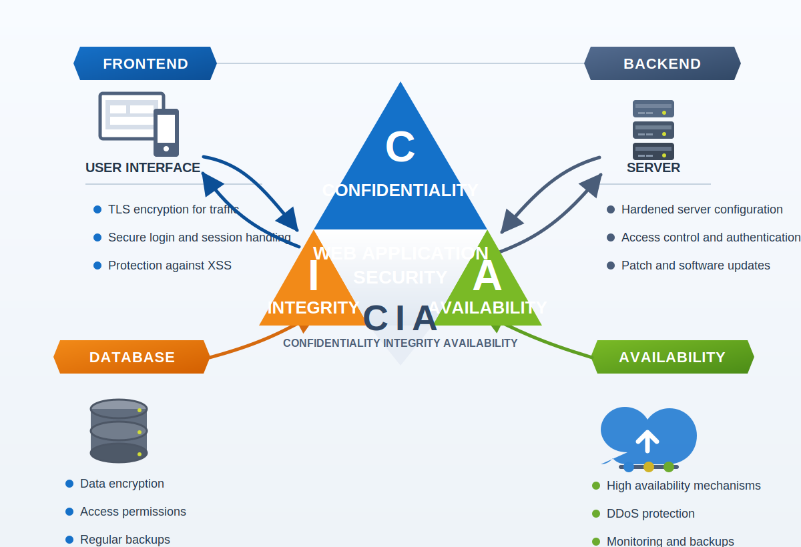

# Lesson 3 - CIA Triad Exercise

## Status
- Completed

## Objective
- Apply the CIA triad to a web application by breaking it into smaller components and identifying practical security controls for each one.

## Task
- Based on the previous lesson, think about how you would secure a web application.
- Divide the application into smaller parts such as the frontend, backend, and database.
- For each part, write down controls that support confidentiality, integrity, and availability.

## Example Diagram

## Example Answer

### 1. Frontend (User Interface)

#### Confidentiality
- Use HTTPS/TLS to encrypt traffic between the user and the server.
- Do not store sensitive data such as passwords in localStorage or in cookies without strong protection.
- Limit data visibility to what the user is authorized to see by using role-based access control.

#### Integrity
- Validate input on both the client side and the server side to reduce the risk of unauthorized changes.
- Use Content Security Policy (CSP) to reduce the risk of malicious scripts modifying content in the browser.

#### Availability
- Reduce page load time and use caching and a CDN so the site stays responsive during heavy traffic.
- Handle frontend errors so one failing component does not block the whole application.

### 2. Backend (Server)

#### Confidentiality
- Encrypt data in transit with HTTPS and protect sensitive files or secrets at rest.
- Use strong authentication and authorization such as secure sessions or JWT-based access control.

#### Integrity
- Validate and sanitize all data received by the server.
- Keep audit logs for important changes in data and administrative actions.
- Prevent attacks such as SQL injection and cross-site scripting by using secure coding practices and defensive controls.

#### Availability
- Use a load balancer and redundant servers to keep the service available during traffic spikes or failures.
- Apply rate limiting to reduce the impact of denial-of-service attempts.

### 3. Database

#### Confidentiality
- Encrypt sensitive data and store passwords as strong password hashes, for example with bcrypt.
- Restrict database access to the application server and authorized administrators only.

#### Integrity
- Use transactions and ACID properties to keep data consistent.
- Perform regular backups and validate important records when needed.

#### Availability
- Use database replication, hot standby systems, and regular backups.
- Monitor the database and prepare automatic recovery procedures for failures.

## Reflection Questions
- Which controls improve more than one pillar of the CIA triad at the same time?
- Which application component would be the highest priority in your environment, and why?
- What additional controls would you add for monitoring and incident response?

## Notes
- A secure web application depends on multiple layers of protection. One weak component can affect the confidentiality, integrity, and availability of the whole system.
