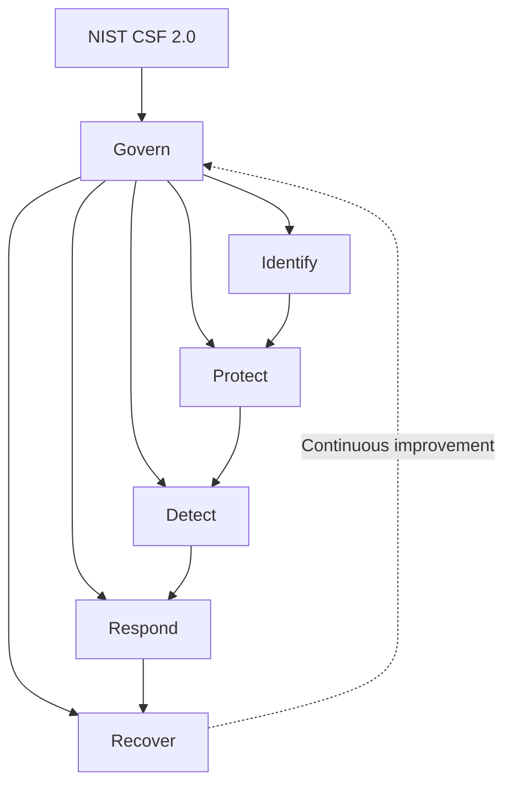

# Lesson 4 - Security as a Process - CSF 2.0

## Lesson Overview
- In this lesson, you will learn the process-based approach to cybersecurity and the NIST CSF 2.0 framework.
- You will see why IT security should be treated as a continuous process rather than a one-time activity, and how to manage organizational risk effectively.

## Learning Objectives
- Understand why cybersecurity is a continuous process.
- Learn the main components of NIST CSF 2.0.
- Learn the six key functions of the CSF 2.0 framework.

## Lesson Resources
- [NIST CSF 2.0 Resource Center](https://www.nist.gov/cyberframework)
- [Examples of Framework Profiles](https://www.nist.gov/cyberframework/examples-framework-profiles)
- [Quick Start Guides](https://www.nist.gov/cyberframework/quick-start-guides)

## Status
- Completed

## Why Security Is a Process
- Security is not a single tool or project. It is an ongoing cycle of governance, assessment, protection, monitoring, response, and improvement.
- Threats, business requirements, and technology change constantly, so controls must be reviewed and adjusted over time.

## NIST CSF 2.0 Overview
- The NIST Cybersecurity Framework 2.0 provides a structured way to manage cybersecurity risk.
- It is useful for organizations of different sizes because it focuses on outcomes rather than prescribing one exact implementation.

## Core Functions
- Govern: define strategy, roles, policies, accountability, and oversight for cybersecurity risk.
- Identify: understand assets, systems, data, dependencies, and business context.
- Protect: implement safeguards that reduce the likelihood or impact of an incident.
- Detect: discover anomalous activity and security events quickly.
- Respond: contain, analyze, communicate, and handle incidents.
- Recover: restore services and improve resilience after disruption.

## CSF 2.0 Diagram

## Why Govern Matters in CSF 2.0
- CSF 2.0 explicitly highlights governance to show that security must be linked to leadership, budgeting, policy, and organizational priorities.
- Without governance, technical controls become inconsistent and difficult to sustain.

## Example Lifecycle
- Identify internet-facing assets and critical business systems.
- Protect them with hardening, access control, and secure configurations.
- Detect suspicious behavior through logs, alerts, and baseline monitoring.
- Respond with documented roles, communication paths, and playbooks.
- Recover using tested backups, failover plans, and post-incident improvements.

## Benefits of a Process Approach
- Makes security measurable and repeatable.
- Improves coordination between technical teams and business owners.
- Reduces the chance that important systems or risks are overlooked.
- Supports audits, compliance, and continuous improvement.

## Notes
- Mature security programs do not chase tools first. They build repeatable processes and use tools to support them.
