# Lesson 5 - Vulnerabilities, CVE, and the CVSS Scoring System

## Status
- Completed

## What Is a Vulnerability?
- A vulnerability is a weakness that can be exploited by an attacker to change how a system behaves.
- Vulnerabilities are often caused by bad configuration, design mistakes, missing updates, or rushed coding shortcuts.
- A software bug is not always exploitable, but an exploitable bug becomes a security vulnerability.

## Common Sources of Vulnerabilities
- Configuration errors: insecure defaults, exposed services, or weak access control settings.
- Design flaws: architectural mistakes that make abuse possible even when the code works as intended.
- Missing updates: unpatched systems and outdated software often contain known weaknesses.
- Unsafe coding practices: rushed fixes and incomplete validation can introduce new security issues.

## Human Factor in Security
- Weak passwords make accounts easier to guess, reuse, or brute-force.
- Phishing attacks trick users into revealing credentials or sensitive information.
- Low security awareness increases the chance of unsafe decisions.
- Training reduces avoidable mistakes and helps people recognize attacks earlier.

## Bug vs Vulnerability
- A bug is an unintended defect in software.
- A vulnerability is a defect or weakness that can be used to perform an attack.
- In practice, a vulnerability is a security-relevant bug with an exploitation path.

## What Happens When a Vulnerability Is Found?
- The issue is reported to the vendor, maintainer, or security team.
- The vulnerability may receive a CVE identifier so it can be tracked consistently across tools and vendors.
- Researchers and vendors often use responsible disclosure, which gives defenders time to patch before full public release.

## Introduction to CVE
- CVE stands for Common Vulnerabilities and Exposures.
- The CVE program was launched in 1999 and is maintained by MITRE.
- Its purpose is to standardize how known vulnerabilities are identified.
- A CVE entry makes it easier to exchange information between security tools, vendors, and defenders.

## Introduction to CVSS
- CVSS stands for Common Vulnerability Scoring System.
- It is a standard method for rating the technical severity of a vulnerability.
- CVSS helps organizations prioritize remediation by comparing issues on a common scale.
- Scores range from 0.0 to 10.0 and are usually interpreted as None, Low, Medium, High, or Critical.

## CVSS Metric Groups
- Base metrics describe the inherent characteristics of the vulnerability itself.
- Temporal metrics adjust the score based on exploit maturity, remediation state, and report confidence.
- Environmental metrics adapt the score to a specific organization and environment.

## CVSS Example: EternalBlue
- EternalBlue is associated with [CVE-2017-0144](https://nvd.nist.gov/vuln/detail/CVE-2017-0144).
- It is a remote code execution vulnerability in Microsoft SMBv1.
- The flaw became widely known because it was easy to weaponize and was used by large-scale malware campaigns.
- It is a useful teaching example because the CVSS vector clearly shows why the vulnerability is technically severe.

## Reading a CVSS v3.1 Vector

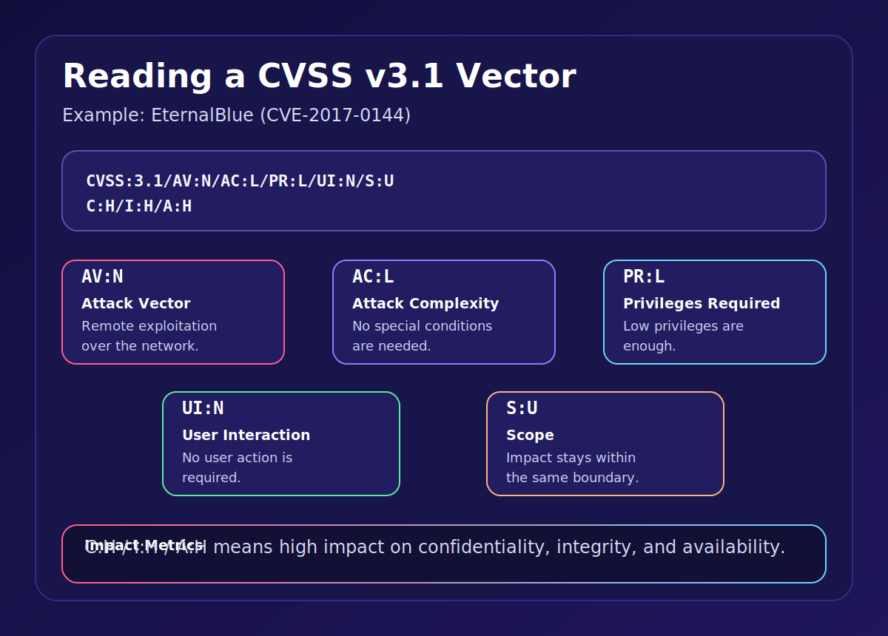

- Example vector: `CVSS:3.1/AV:N/AC:L/PR:L/UI:N/S:U/C:H/I:H/A:H`
- `AV:N` means the attack can be launched over the network.
- `AC:L` means no special conditions are required.
- `PR:L` means only low privileges are needed.
- `UI:N` means no victim interaction is required.
- `S:U` means the impact stays within the same security boundary.
- `C:H/I:H/A:H` means the attack has high impact on confidentiality, integrity, and availability.

### Vector Explained: Attack Vector

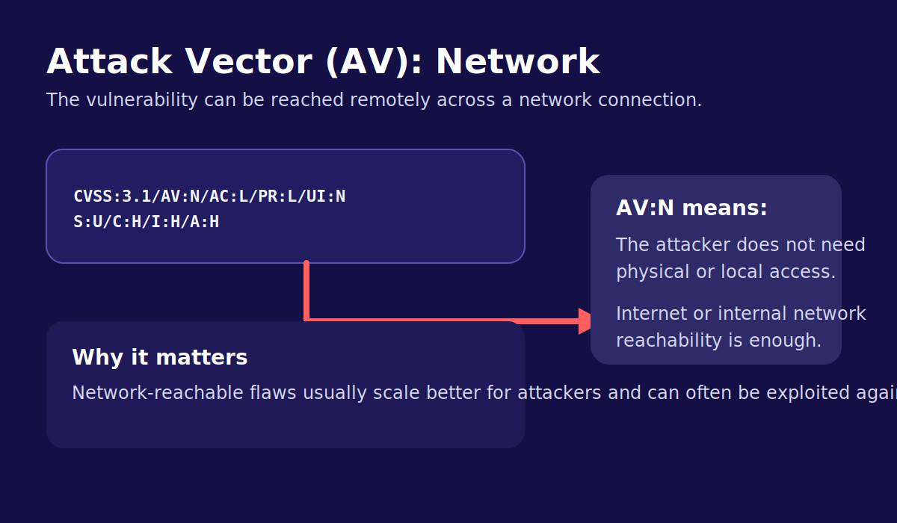

Attack Vector describes how close the attacker must be to the vulnerable target. In this example, `AV:N` means the attacker can reach the target remotely through the network.

### Vector Explained: Attack Complexity

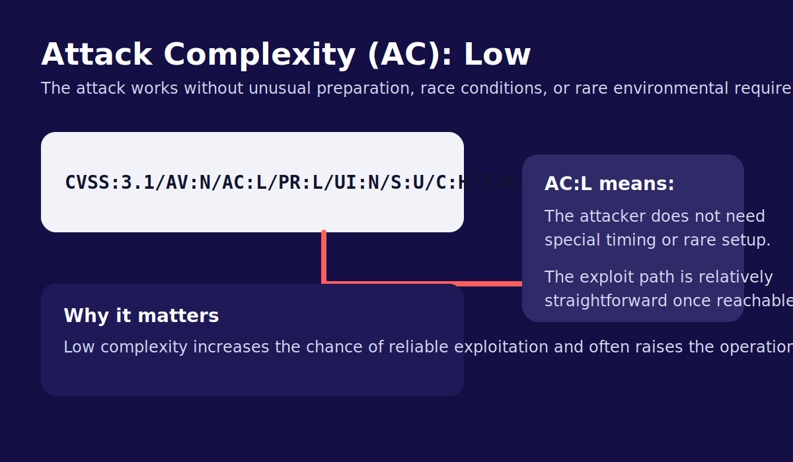

Attack Complexity measures whether the exploit needs unusual timing, preparation, or environmental conditions. `AC:L` means the attack path is relatively straightforward.

### Vector Explained: User Interaction

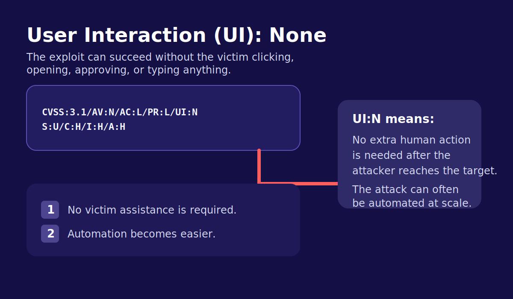

User Interaction shows whether another person must do something for exploitation to succeed. `UI:N` means the attack can succeed without clicks, approvals, or manual participation from the victim.

### Vector Explained: Scope

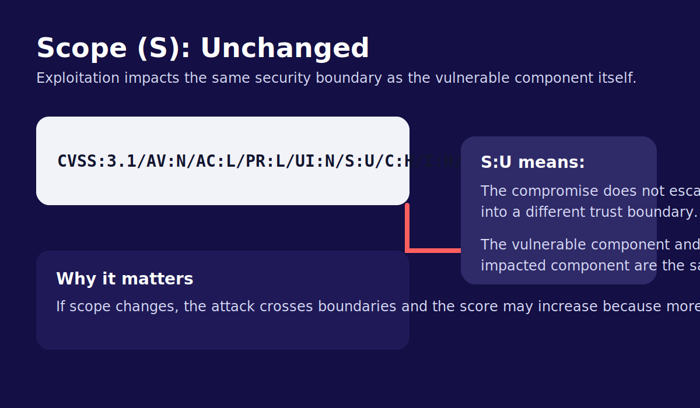

Scope tells us whether the attack stays inside the same security boundary or crosses into another one. `S:U` means the vulnerable component and the impacted component are within the same boundary.

## Second CVSS Example: GitLab CVE-2021-22205
- [CVE-2021-22205](https://nvd.nist.gov/vuln/detail/CVE-2021-22205) affected GitLab Community Edition and Enterprise Edition.
- The issue was caused by improper validation of image files sent to a file parser, which could result in remote code execution.
- The published CVSS v3.1 vector is `CVSS:3.1/AV:N/AC:L/PR:N/UI:N/S:C/C:H/I:H/A:H`.
- GitLab rated this vulnerability as `10.0 Critical`, which makes it a strong example of how CVSS identifies extremely dangerous issues.

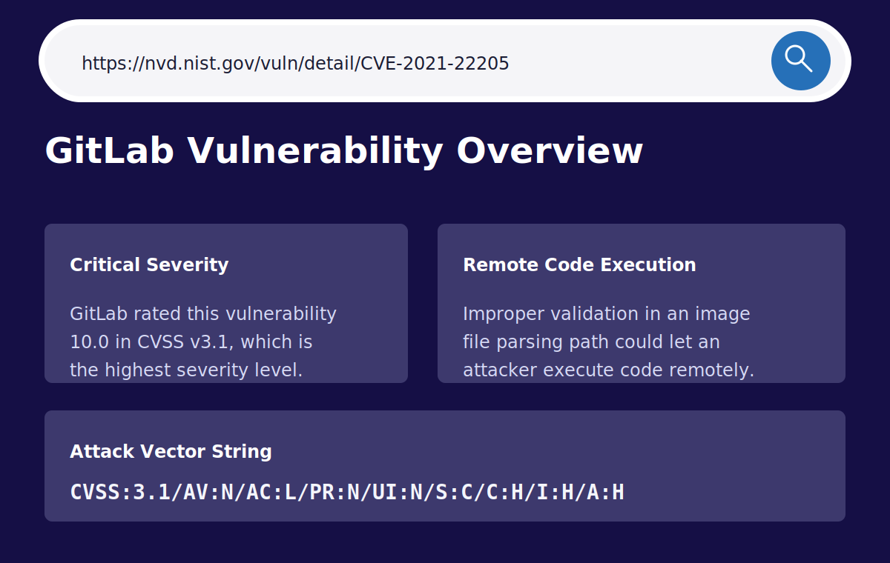

### Breaking Down the GitLab Vector

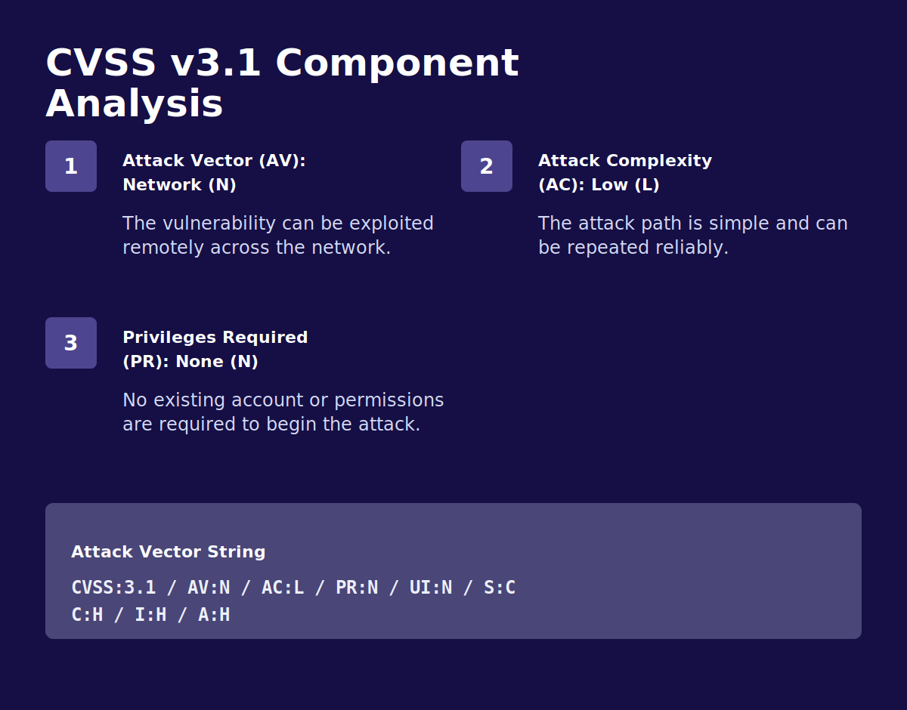

- `AV:N` means the attack can be delivered over the network.
- `AC:L` means exploitation does not require unusual conditions.
- `PR:N` means no account or prior privileges are required.
- `UI:N` means the victim does not need to click, approve, or open anything.
- These four values together describe an attack that is remote, simple, and easy to automate.

### Scope Changed

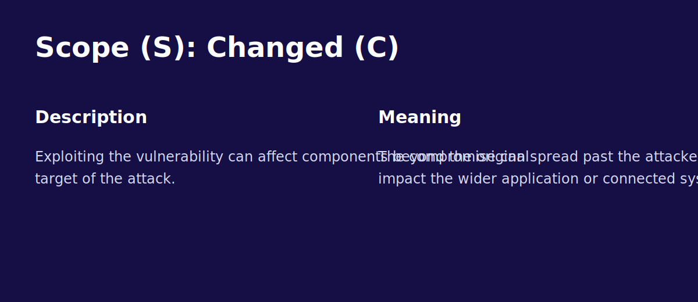

- `S:C` means Scope Changed.
- This is different from the earlier EternalBlue example, which used `S:U` for Scope Unchanged.
- A changed scope means exploitation can affect resources beyond the original vulnerable component, which often increases severity.

### Impact on Confidentiality, Integrity, and Availability
- `C:H` means the attacker can obtain sensitive data.
- `I:H` means the attacker can modify or destroy important data.
- `A:H` means the attacker can seriously disrupt or fully stop services.

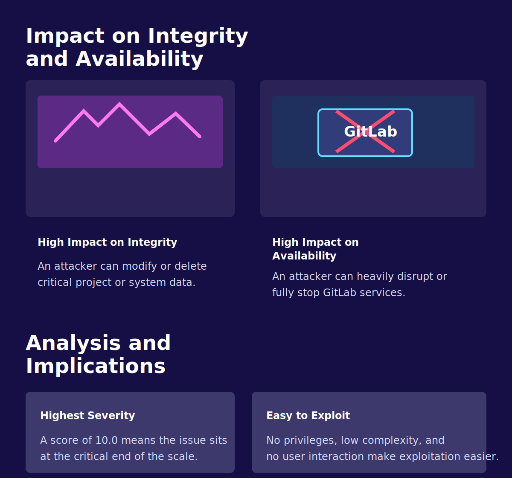

### Why This Example Matters
- It shows how a vulnerability can reach the maximum CVSS score without any user interaction.
- It demonstrates why `PR:N` and `S:C` are especially important when reading a vector string.
- It also reinforces that CVSS can communicate both exploitability and business-relevant operational impact.

## How to Use CVSS Correctly
- CVSS is a severity score, not a complete business risk score.
- A lower CVSS issue on an internet-facing identity system may still be more urgent than a higher CVSS issue on an isolated lab machine.
- Good prioritization combines CVSS with asset value, exposure, exploit availability, and compensating controls.

## Responding to High and Critical Vulnerabilities

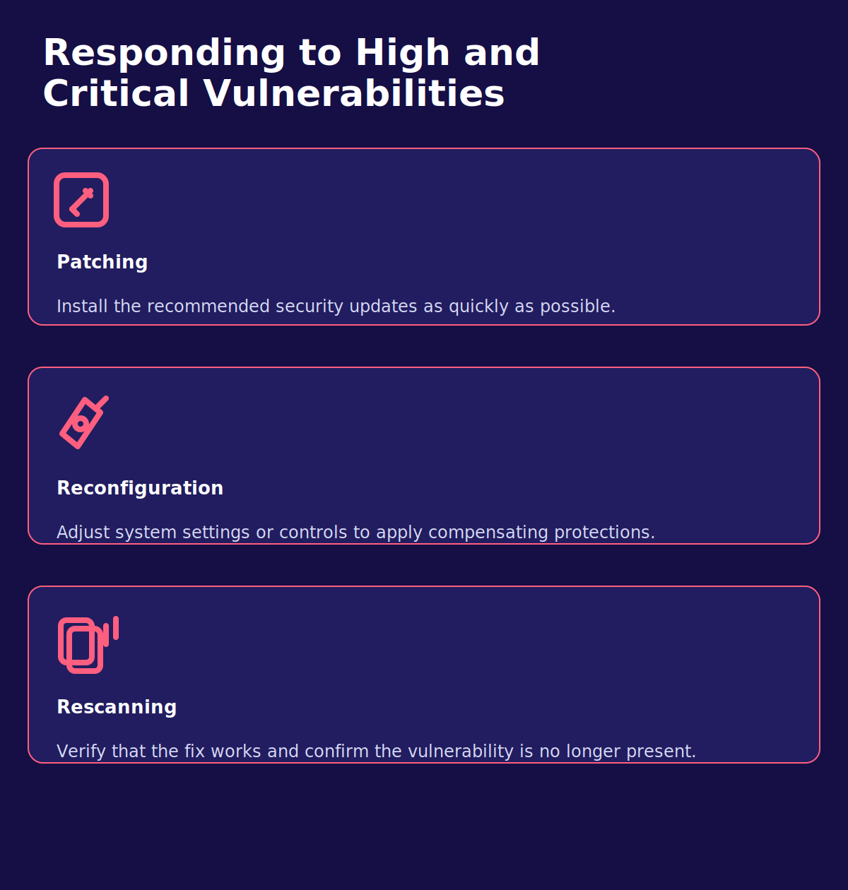

- Patching: install the relevant security updates immediately when a tested fix is available.
- Reconfiguration: apply compensating controls or safer settings when a patch cannot be deployed at once.
- Rescanning: validate the effectiveness of the fix and confirm the vulnerability is no longer detectable.

## Chaining Vulnerabilities

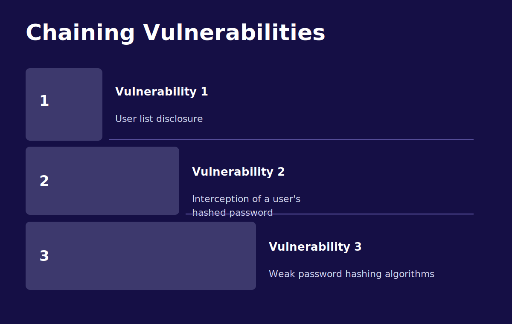

- Attackers often combine several smaller weaknesses into one larger attack path.
- For example, one issue may expose a user list, another may reveal password hashes, and a third may allow those hashes to be cracked because the hashing algorithm is weak.
- Looking at vulnerabilities one by one can hide the real severity of the combined attack.

## A Holistic Approach to Vulnerability Management

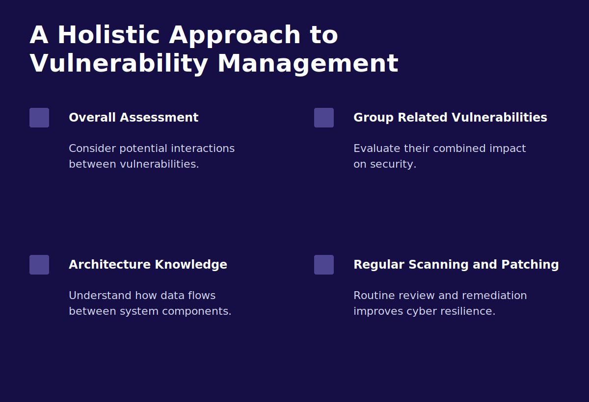

- Evaluate how separate vulnerabilities may interact with each other.
- Group related issues and assess their combined impact on the system.
- Understand the system architecture and data flows so you know which weaknesses can be chained.
- Perform regular scanning and patching to reduce the chance that these chains remain exploitable.

## Using the CVSS Calculator

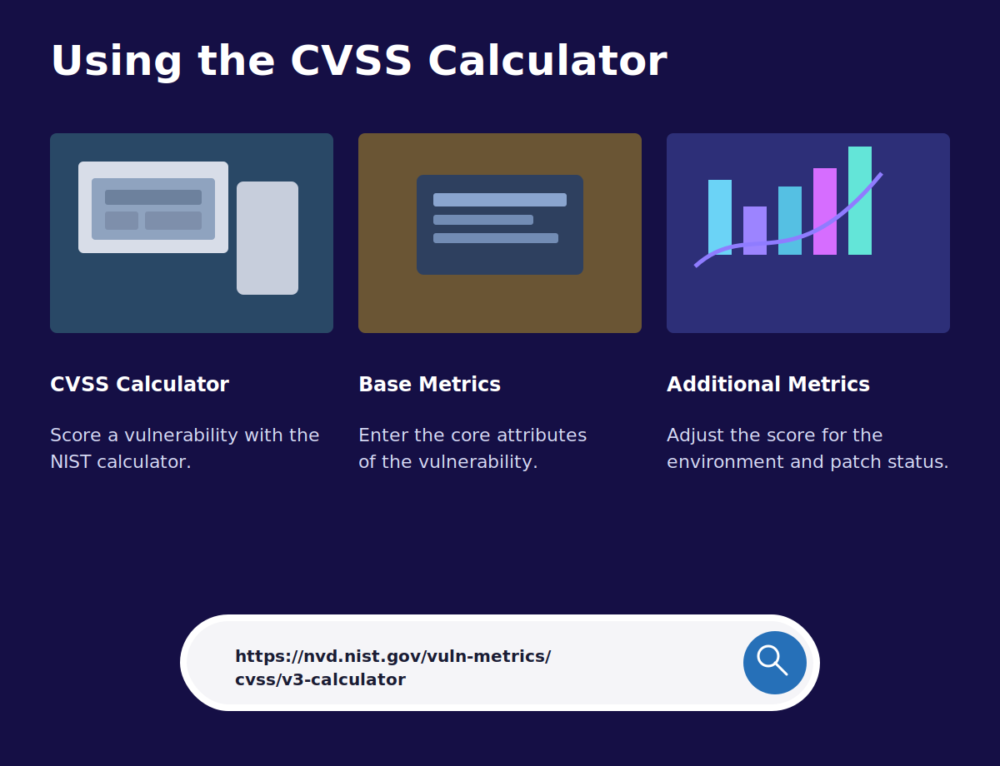

- The NIST CVSS calculator helps translate vulnerability details into a consistent severity score.
- Start with the base metrics, which describe the technical properties of the vulnerability.
- Then consider temporal or environmental adjustments when the deployment context changes the practical severity.
- Reference tool: [NIST CVSS v3.x Calculator](https://nvd.nist.gov/vuln-metrics/cvss/v3-calculator).

## Notes
- Vulnerability management works best when discovery, scoring, patching, and validation are treated as one continuous process.
