# Lesson 7 - Threats and Threat Modeling

## Status
- Completed

## What Is a Threat?
- A threat is any potential cause of harm to a system, process, user, or organization.
- Threats can come from external attackers, malicious insiders, accidents, supply chain failures, or natural events.

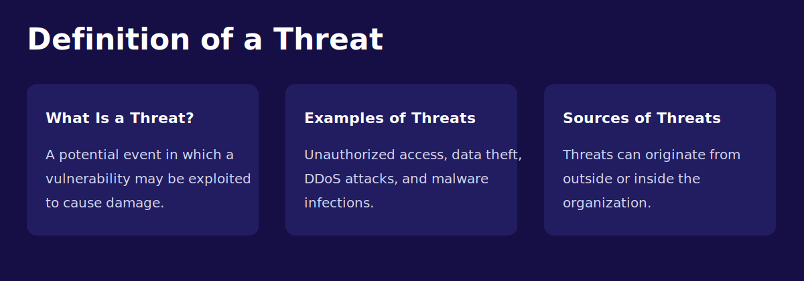

- A threat can also be described as a potential event in which a vulnerability may be exploited to cause damage.
- Common examples include unauthorized access, data theft, DDoS attacks, and malware infections.
- Threats may originate from both outside and inside the organization.

## Threat Categories
- Human threats: cybercriminals, hacktivists, state actors, competitors, insiders.
- Technical threats: malware, exploitation of vulnerabilities, denial-of-service attacks.
- Process threats: weak approvals, missing backups, poor offboarding, insecure change management.
- Environmental threats: fire, flood, power failure, hardware failure.

## External Threats

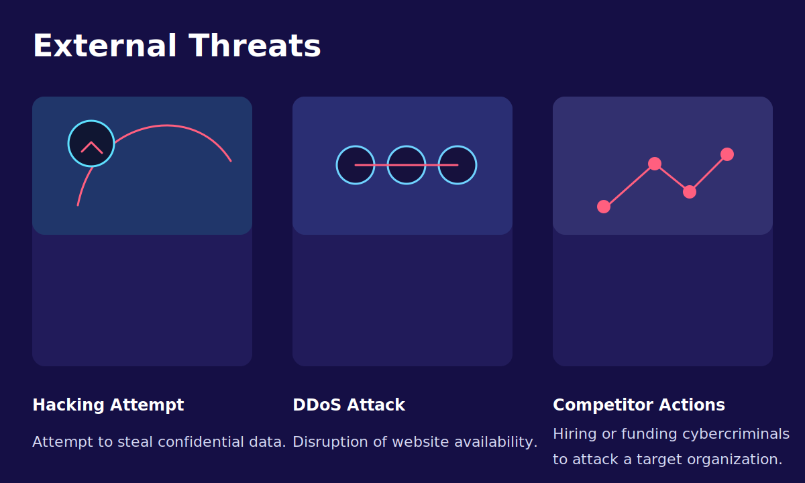

- Hacking attempts may target confidential data, credentials, or exposed services.
- DDoS attacks try to make websites or online services unavailable.
- Competitors or hostile third parties may fund or commission malicious activity.

## Internal Threats

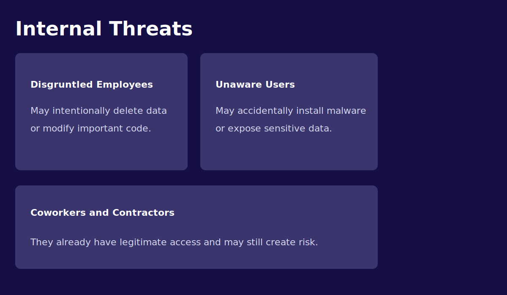

- Disgruntled employees may intentionally delete data or alter important code and settings.
- Unaware users can accidentally install malware or expose sensitive information.
- Coworkers, administrators, and contractors already have legitimate access, which increases the potential impact of misuse.

## What Threat Modeling Is
- Threat modeling is a structured method for identifying what could go wrong in a system and deciding which controls are needed.
- It is most effective early in design, but it also provides value when reviewing existing systems.

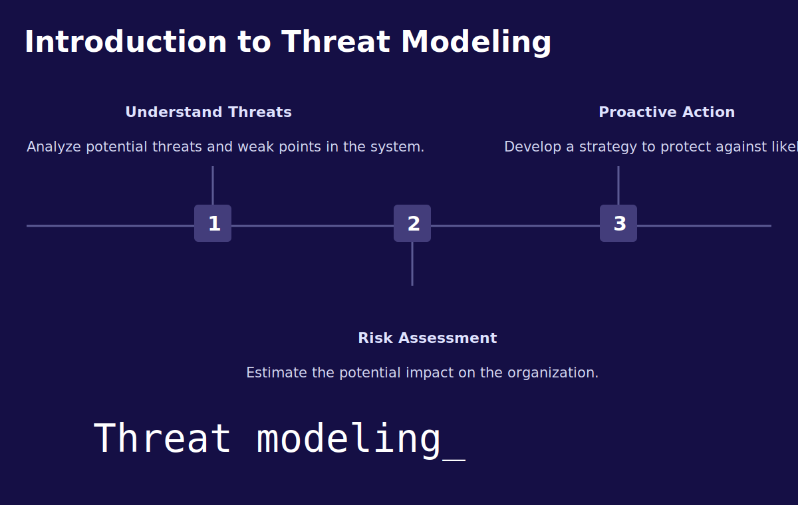

- It starts with understanding likely threats and weak points in the system.
- It continues with risk assessment so the organization can estimate business impact.
- The result should be proactive defensive actions rather than reacting only after incidents occur.

## The Attacker's Perspective

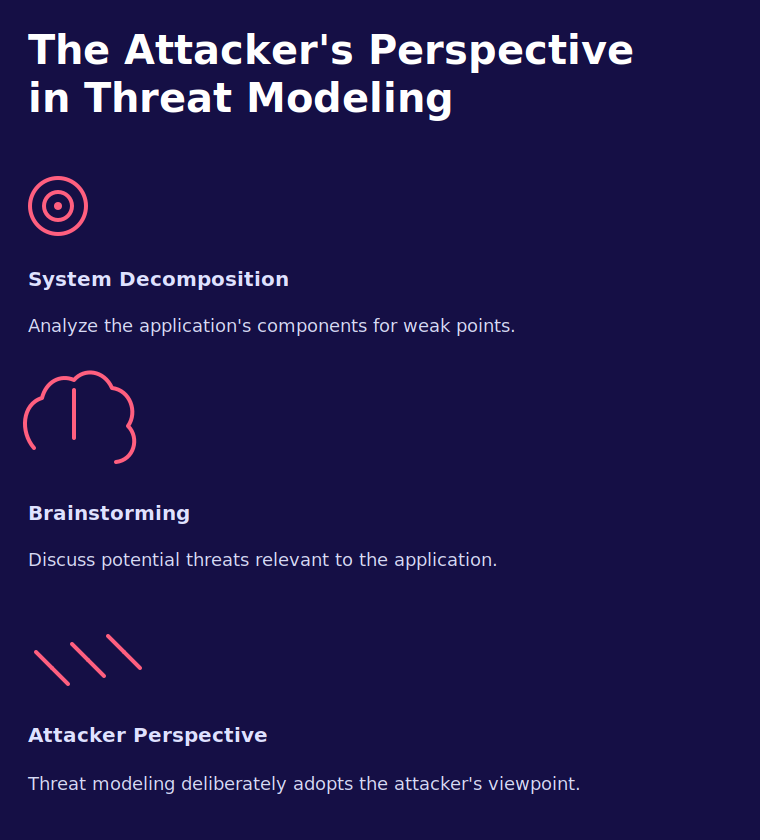

- System decomposition helps break the application into components, data flows, and trust boundaries that can be analyzed for weak points.
- Brainstorming encourages the team to discuss realistic abuse cases and attack paths.
- Threat modeling is valuable because it deliberately looks at the system from the attacker's point of view rather than only from the defender's checklist.

## Typical Threat Modeling Steps
- Define the scope and business purpose of the system.
- Identify assets such as data, credentials, APIs, and privileged functions.
- Map components, trust boundaries, data flows, and external dependencies.
- List possible threats against each component and flow.
- Rate the threats by likelihood and impact.
- Select mitigations and track the remaining risk.

## Common Frameworks
- STRIDE: spoofing, tampering, repudiation, information disclosure, denial of service, elevation of privilege.
- Attack trees: visual breakdowns of how an attacker might achieve a goal.
- Abuse cases: scenarios that describe how a feature can be misused.

## Four Key Questions

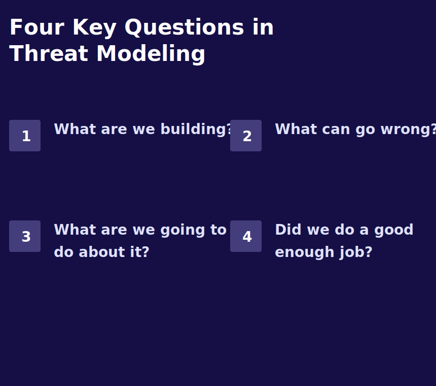

- What are we building?
- What can go wrong?
- What are we going to do about it?
- Did we do a good enough job?

## Step 1: What Are We Building?

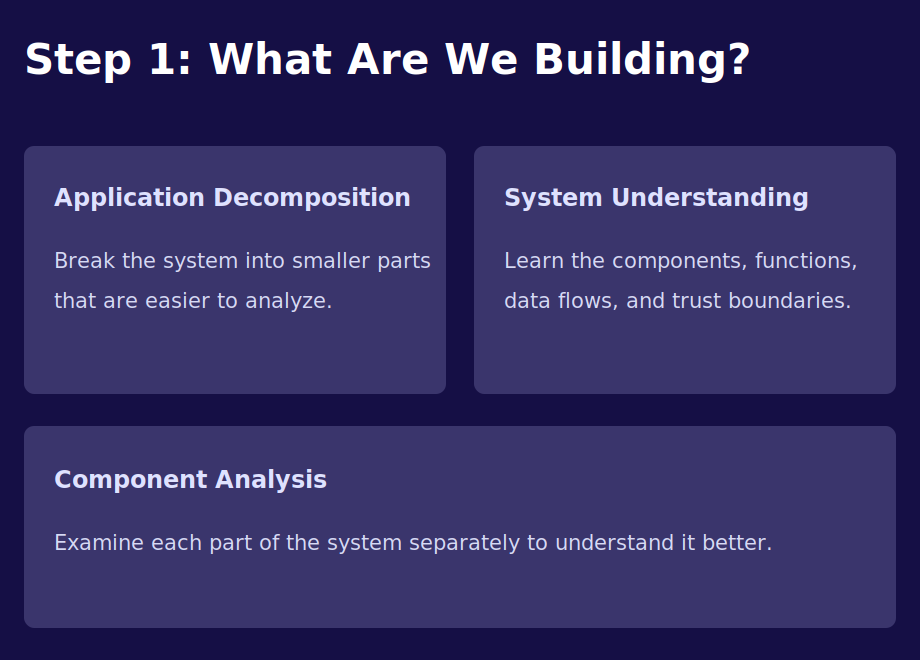

- Start by decomposing the application into smaller parts that are easier to reason about.
- Build a clear understanding of components, functions, data flows, and trust boundaries.
- Review each component separately so the team understands the system before listing threats.

## Step 2: What Can Go Wrong?

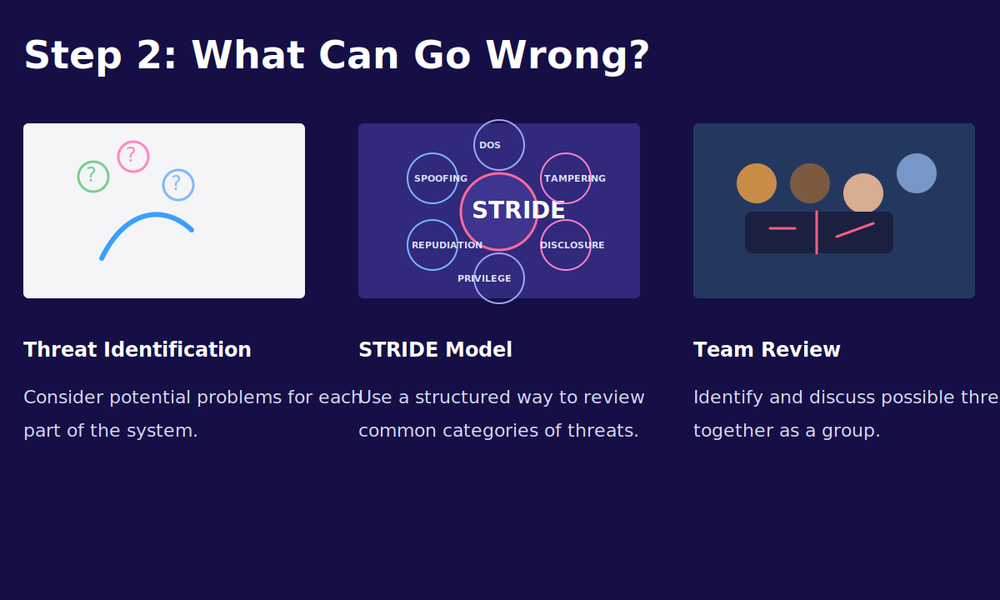

- Identify threats for each part of the system instead of thinking only at a high level.
- Use a framework such as STRIDE to avoid missing common categories of abuse.
- Discuss the threats as a team so different people can challenge assumptions and add scenarios.

## Practical References

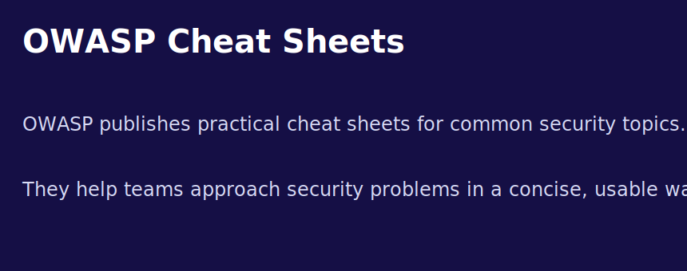

- OWASP Cheat Sheets provide short, practical guidance for common security problems.
- They are useful during threat modeling when the team needs mitigation ideas, secure design reminders, or implementation guidance.

## Outputs of Threat Modeling
- Better system diagrams and trust-boundary awareness.
- A prioritized list of security requirements.
- Early detection of design weaknesses before implementation costs increase.
- A shared understanding between developers, architects, and security teams.

## Team Participation

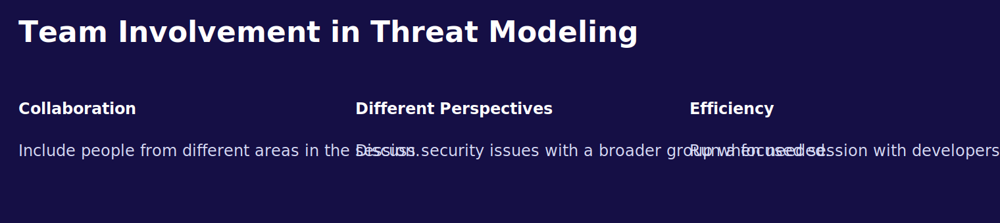

- Invite people from different roles when the system or business process is complex.
- Broader participation improves coverage because each role sees different risks and assumptions.
- When time is limited, a focused session with the core engineering team is usually better than a large unfocused meeting.

## Attacker Goals and Motivation

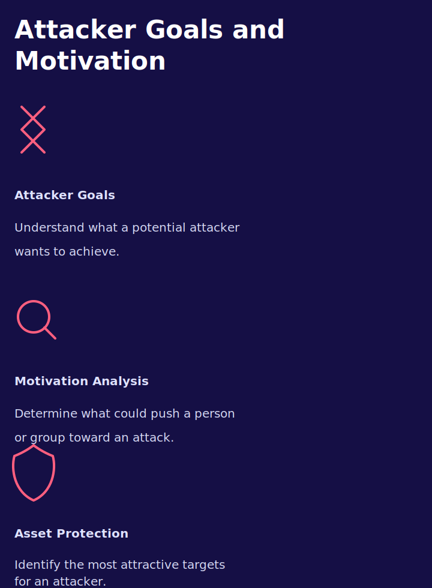

- Understanding attacker goals helps explain what the adversary is trying to achieve.
- Motivation analysis helps identify why a person or group might launch an attack.
- Asset protection improves when we identify which resources are most attractive to attackers.

## Threat Modeling vs Vulnerability Assessment

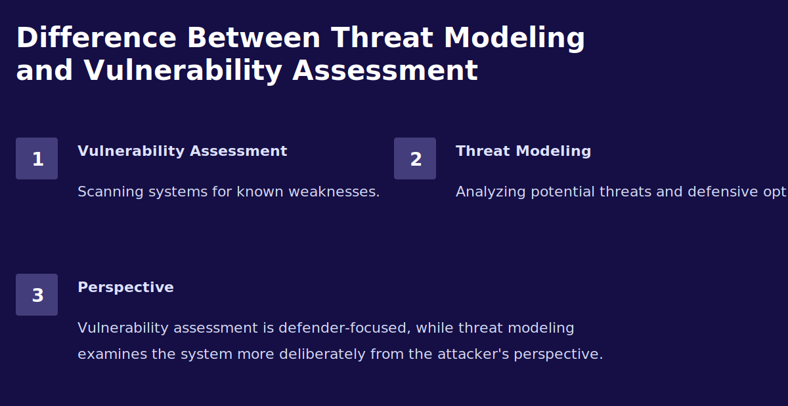

- Vulnerability assessment focuses on finding known weaknesses in systems and software.
- Threat modeling focuses on how attackers might misuse the design, architecture, data flows, or trust relationships.
- A useful rule of thumb is that vulnerability assessment is more defender-centric, while threat modeling deliberately studies the attacker's perspective.

## Notes
- Threat modeling is not about predicting every attack. It is about systematically reducing blind spots.
