# Lesson 7 - Threats and Threat Modeling

## Status
- Completed

## What Is a Threat?
- A threat is any potential cause of harm to a system, process, user, or organization.
- Threats can come from external attackers, malicious insiders, accidents, supply chain failures, or natural events.

- A threat can also be described as a potential event in which a vulnerability may be exploited to cause damage.
- Common examples include unauthorized access, data theft, DDoS attacks, and malware infections.
- Threats may originate from both outside and inside the organization.

## Threat Categories
- Human threats: cybercriminals, hacktivists, state actors, competitors, insiders.
- Technical threats: malware, exploitation of vulnerabilities, denial-of-service attacks.
- Process threats: weak approvals, missing backups, poor offboarding, insecure change management.
- Environmental threats: fire, flood, power failure, hardware failure.

## External Threats

- Hacking attempts may target confidential data, credentials, or exposed services.
- DDoS attacks try to make websites or online services unavailable.
- Competitors or hostile third parties may fund or commission malicious activity.

## Internal Threats

- Disgruntled employees may intentionally delete data or alter important code and settings.
- Unaware users can accidentally install malware or expose sensitive information.
- Coworkers, administrators, and contractors already have legitimate access, which increases the potential impact of misuse.

## What Threat Modeling Is
- Threat modeling is a structured method for identifying what could go wrong in a system and deciding which controls are needed.
- It is most effective early in design, but it also provides value when reviewing existing systems.

- It starts with understanding likely threats and weak points in the system.
- It continues with risk assessment so the organization can estimate business impact.
- The result should be proactive defensive actions rather than reacting only after incidents occur.

## The Attacker's Perspective

- System decomposition helps break the application into components, data flows, and trust boundaries that can be analyzed for weak points.
- Brainstorming encourages the team to discuss realistic abuse cases and attack paths.
- Threat modeling is valuable because it deliberately looks at the system from the attacker's point of view rather than only from the defender's checklist.

## Typical Threat Modeling Steps
- Define the scope and business purpose of the system.
- Identify assets such as data, credentials, APIs, and privileged functions.
- Map components, trust boundaries, data flows, and external dependencies.
- List possible threats against each component and flow.
- Rate the threats by likelihood and impact.
- Select mitigations and track the remaining risk.

## Common Frameworks
- STRIDE: spoofing, tampering, repudiation, information disclosure, denial of service, elevation of privilege.
- Attack trees: visual breakdowns of how an attacker might achieve a goal.
- Abuse cases: scenarios that describe how a feature can be misused.

## Example: STRIDE Analysis for an Online Store

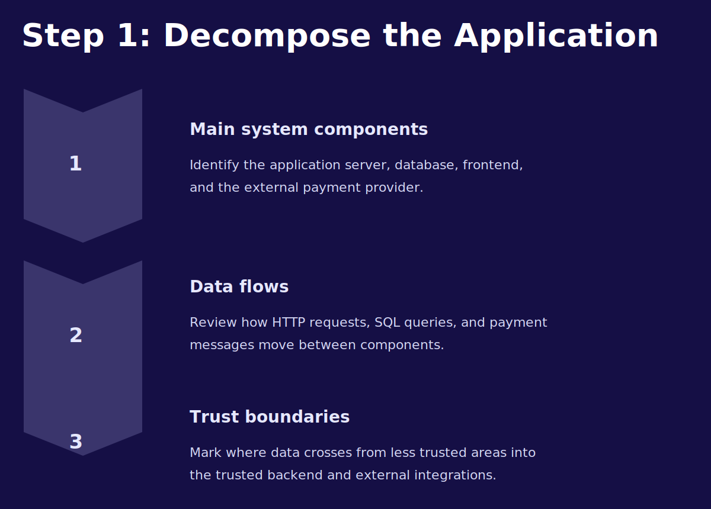

- In this example, we model a simple online store with a frontend, an application server, a database, and an external payment provider.
- The first step is decomposition: identify the main components, the data they handle, and where trust changes.
- This gives us a concrete system to review with STRIDE instead of discussing threats only in theory.

### Main Components of the System

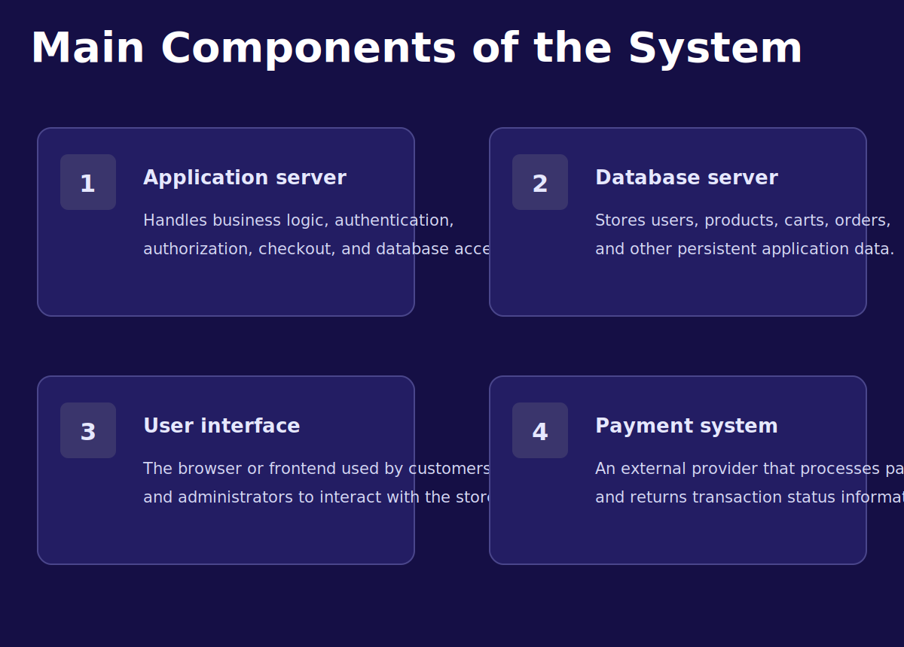

- Application server: handles business logic, authentication, authorization, checkout, and communication with other systems.
- Database server: stores users, products, carts, orders, and other persistent business data.
- User interface: the browser or frontend through which customers and administrators interact with the store.
- Payment system: an external service used to process payments and return payment status information.

### Data Flows and Trust Boundaries

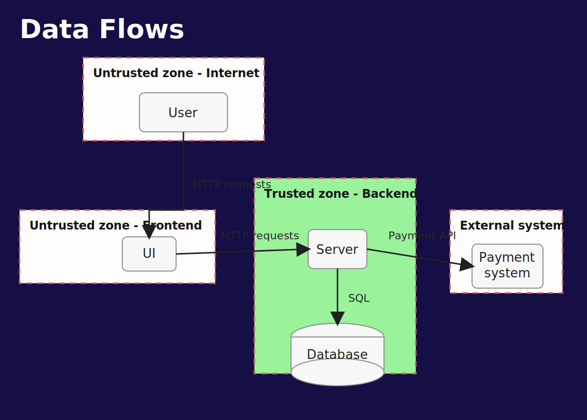

- The internet user and the frontend are treated as less trusted because input originates outside the backend's control.
- The backend and database form the trusted core of the application, but they still need internal access control and monitoring.
- The payment provider is external, so all integration points must be authenticated, validated, and logged.

### STRIDE Findings for the Online Store

#### Spoofing
- An attacker may try to hijack a customer session and place orders as that user.
- A fake admin login page could be used to steal privileged credentials.
- A forged payment callback could trick the server into marking an unpaid order as paid.

#### Tampering
- A customer may modify product prices, discount values, or item quantities before checkout if the server trusts client-side data.
- An attacker could alter order identifiers or request parameters to manipulate another user's cart or order.
- Payment status messages must be validated so third parties cannot change transaction state without authorization.

#### Repudiation
- A user may deny placing an order if login events, cart changes, and checkout actions are not logged clearly.
- An administrator could change product prices or refund data and later deny doing so when audit trails are weak.
- Without reliable timestamps and user attribution, incident investigation becomes much harder.

#### Information Disclosure
- Weak access control could expose customer profiles, addresses, order history, or payment-related metadata.
- Verbose error messages may reveal SQL details, internal API paths, or other useful information to attackers.
- Data sent between components must be protected so sensitive information is not leaked in transit or in logs.

#### Denial of Service
- Attackers may flood login, search, or checkout endpoints with requests until the store becomes slow or unavailable.
- Large numbers of expensive product searches or cart updates can exhaust application or database resources.
- The payment dependency can also become a bottleneck if retry logic or timeouts are handled poorly.

#### Elevation of Privilege
- A regular customer may attempt to access administrative routes or backend endpoints intended only for staff.
- Broken authorization checks could let one user view or manage another user's orders.
- If roles are enforced only in the UI, an attacker may bypass the frontend and call privileged functions directly.

### Example Mitigations
- Use strong authentication, secure session management, and signed or authenticated callbacks from payment providers.
- Validate all critical data on the server and never trust prices, roles, or order state sent by the client.
- Record important security events such as logins, order creation, refunds, and administrative changes.
- Apply least privilege, rate limiting, transport encryption, and regular review of trust boundaries and external integrations.

### Component Example: User Interface

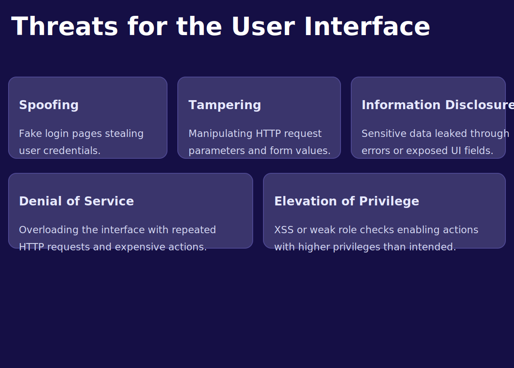

- This narrower view applies STRIDE only to the GUI, where attackers interact directly with forms, buttons, parameters, and visible data.
- Spoofing: fake login pages can trick users into entering credentials.
- Tampering: manipulated HTTP parameters can change prices, quantities, or target resources.
- Information disclosure: error messages or exposed fields may leak sensitive data.
- Denial of service: repeated HTTP requests can overload visible entry points such as login or search.
- Elevation of privilege: XSS or broken client-side role checks may let an attacker act with stronger permissions.

### Component Example: Payment System

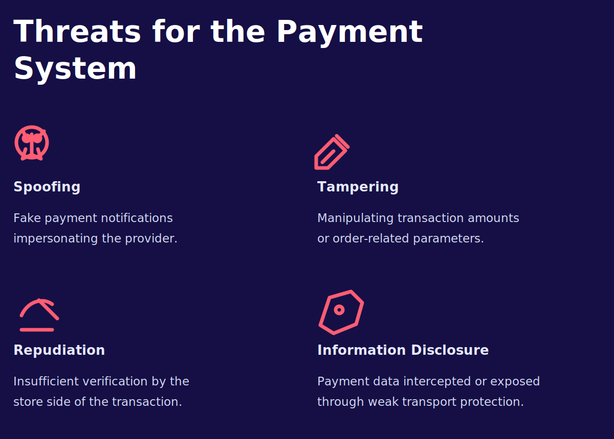

- The payment integration deserves separate review because it crosses a trust boundary into an external provider.
- Spoofing: fake payment notifications can impersonate the legitimate payment service.
- Tampering: transaction amounts, order identifiers, or status fields can be altered if integrity checks are weak.
- Repudiation: without reliable verification and logs, the store may not be able to prove what payment event occurred.
- Information disclosure: intercepted or poorly protected traffic can expose payment-related data.
- In practice, these risks are reduced with signed callbacks, strict request validation, transport encryption, and detailed audit logging.

## Using STRIDE to Analyze a User Interface

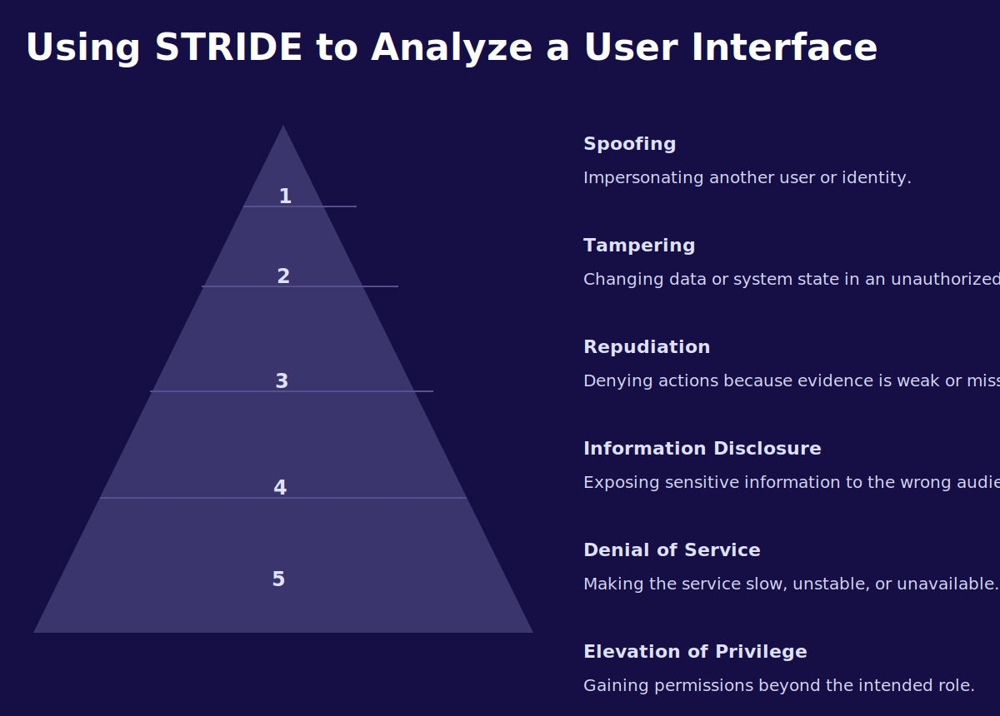

- STRIDE is useful when reviewing user interfaces because many attack paths start with forms, workflows, exposed actions, or visible data.
- A UI-focused STRIDE review asks how a user-facing feature could be impersonated, manipulated, denied, abused, overloaded, or used to gain extra privileges.
- This does not replace server-side analysis, but it helps the team spot risky entry points earlier.

### Spoofing in the User Interface

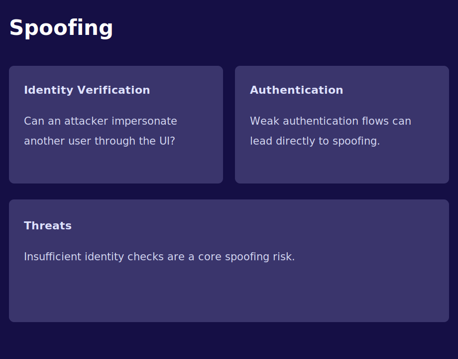

- Ask whether an attacker can pretend to be another user through the interface.
- Weak authentication, weak session handling, or poor identity checks can make spoofing easier.
- Login, password reset, and account recovery flows deserve special attention.

### Tampering in the User Interface

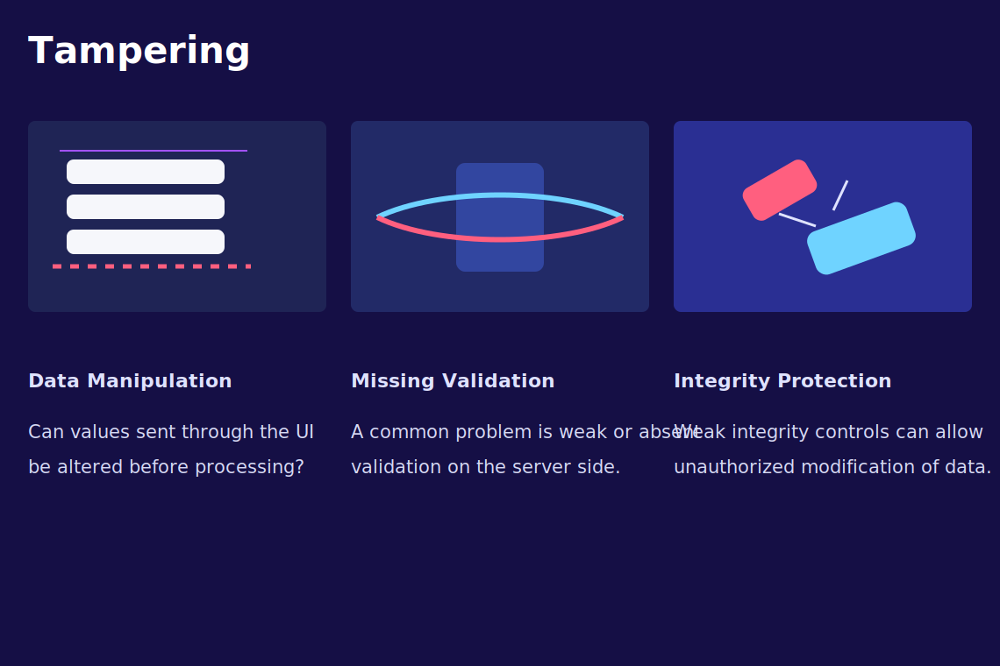

- Ask whether values submitted through the interface can be modified in unintended ways.
- Server-side validation is critical because client-side controls alone do not stop tampering.
- Sensitive actions should also verify integrity, allowed state transitions, and authorization.

### Repudiation in the User Interface

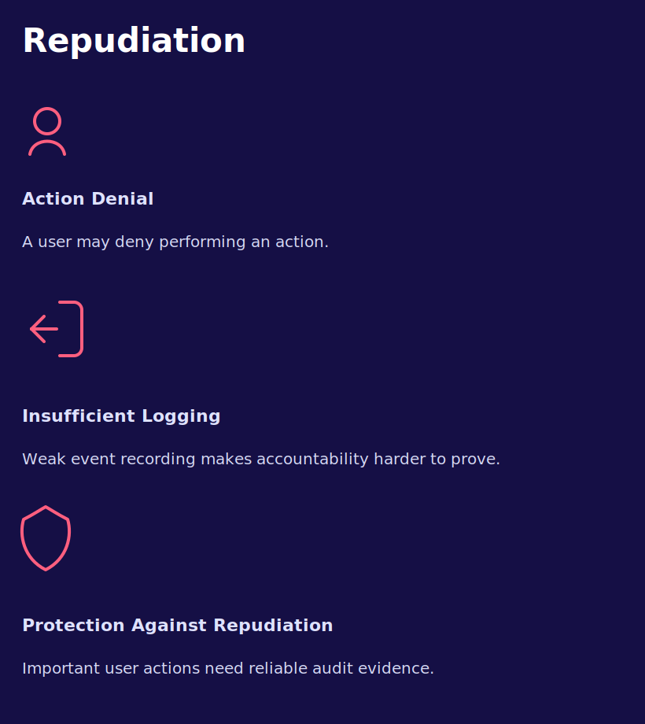

- Ask whether a user can deny performing an action because the system cannot prove what happened.
- Missing logs, weak audit trails, or poor event attribution make repudiation harder to investigate.
- Important operations should record who acted, what changed, and when it happened.

### Information Disclosure in the User Interface

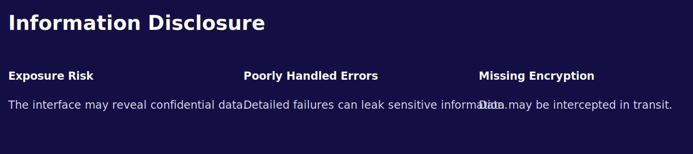

- Ask whether the interface exposes sensitive data to the wrong people.
- Poorly handled errors, excessive detail in the UI, or weak transport protection can leak information.
- Review what the page reveals before login, after login, and during failure cases.

### Denial of Service in the User Interface

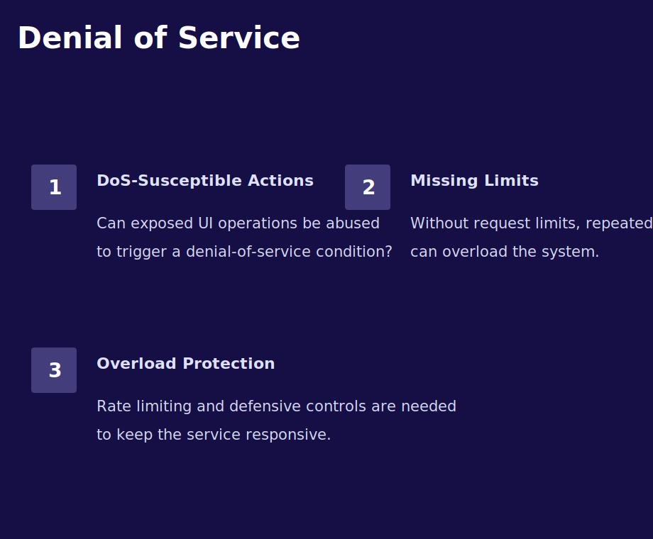

- Ask whether visible UI actions can be abused to overwhelm the system.
- Missing rate limits, expensive searches, or unbounded upload and form processing can enable denial-of-service conditions.
- Controls such as throttling, quotas, caching, and graceful degradation reduce this risk.

### Elevation of Privilege in the User Interface

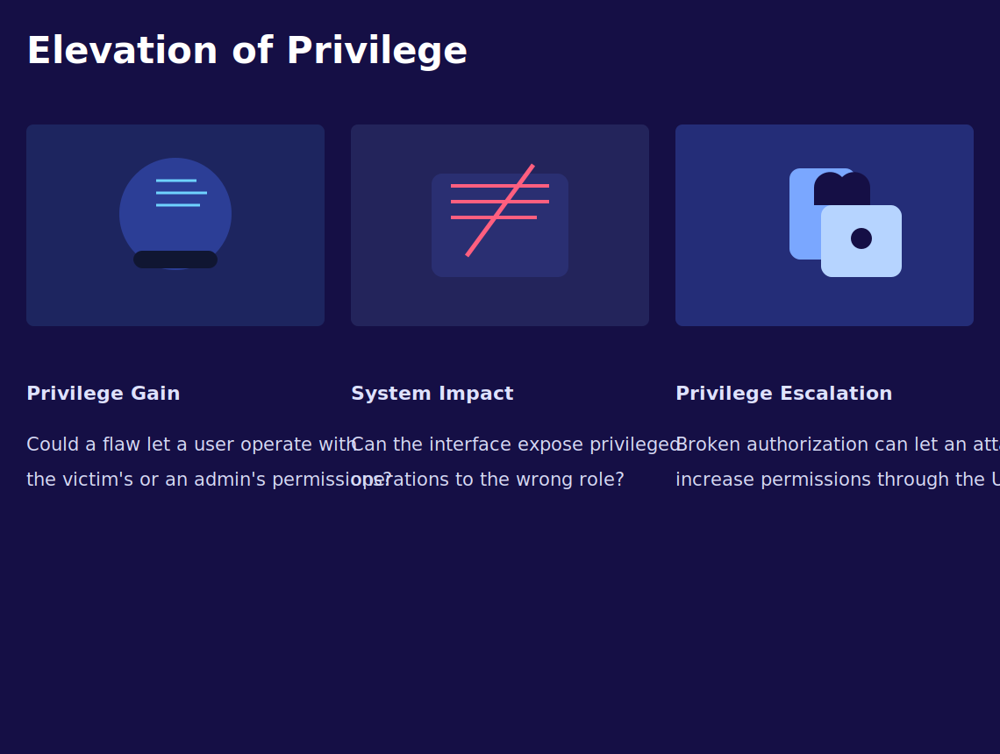

- Ask whether a lower-privileged user can reach actions or data meant for higher-privileged roles.
- Broken authorization, unsafe admin flows, and client-controlled role checks are common causes.
- Every privileged action should be enforced on the server, even if the UI hides the control.

## Strengths of STRIDE

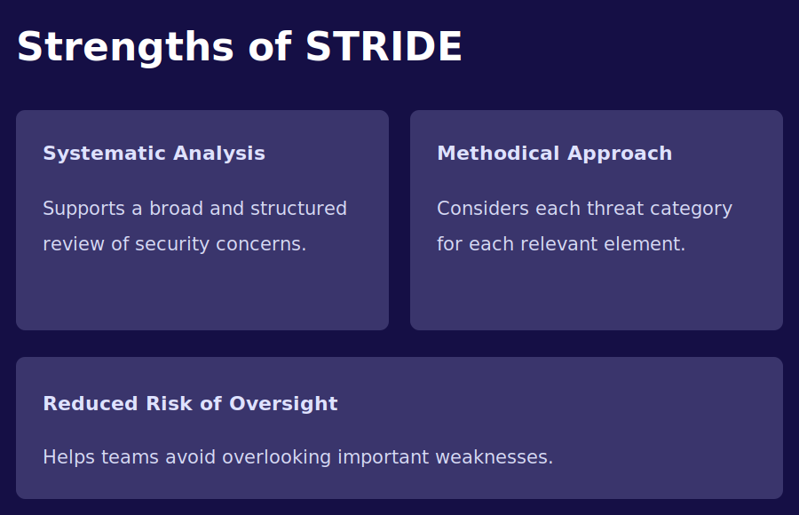

- STRIDE gives teams a systematic way to review common categories of threats.
- Its structured approach reduces the chance that important areas are skipped during analysis.
- It is especially useful for workshops because it gives people a shared vocabulary for discussing risk.

## Limitations of STRIDE

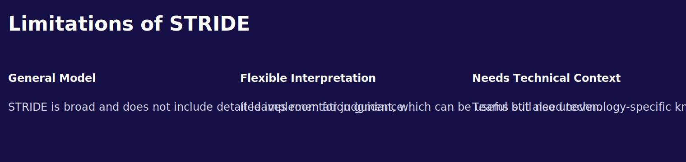

- STRIDE is a general model, so it does not automatically provide deep, technology-specific guidance.
- Teams still need technical knowledge of the application, platform, and architecture to use it well.
- It works best as a framework for thinking, not as a substitute for secure design review, testing, or operational context.

## Other Threat Modeling Frameworks

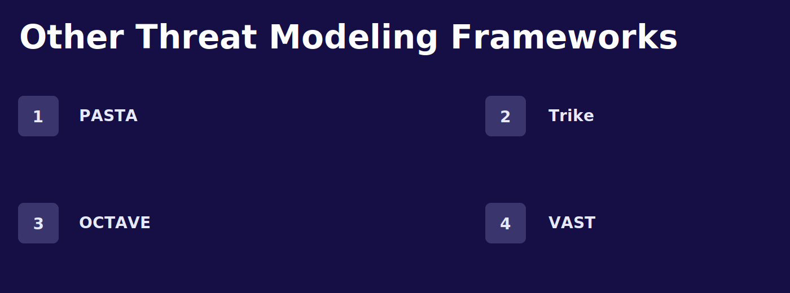

- PASTA focuses on attacker-driven analysis and business impact across multiple stages.
- Trike emphasizes risk management and stakeholder-defined acceptable risk levels.
- OCTAVE is oriented toward organizational risk, critical assets, and operational context.
- VAST is designed to scale threat modeling across larger enterprises and development pipelines.
- STRIDE is often the easiest starting point for technical teams, but it is not the only valid framework.

## Threat Modeling Tools

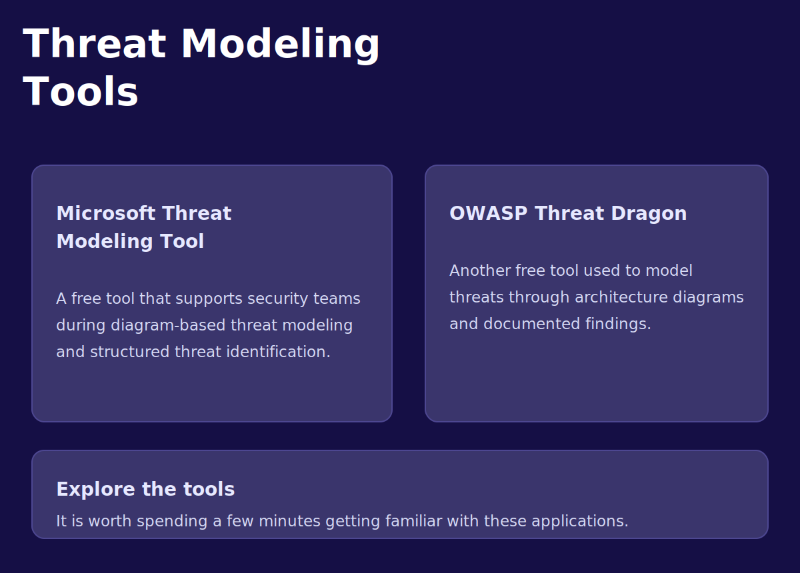

- Microsoft Threat Modeling Tool is a free option that helps teams build diagrams, identify trust boundaries, and generate structured threat lists.
- OWASP Threat Dragon is another free tool that supports diagram-based threat modeling and is widely used in learning environments.
- Spending time with these tools is useful because they make threat modeling more repeatable and easier to document.

## Four Key Questions

- What are we building?
- What can go wrong?
- What are we going to do about it?
- Did we do a good enough job?

## Step 1: What Are We Building?

- Start by decomposing the application into smaller parts that are easier to reason about.
- Build a clear understanding of components, functions, data flows, and trust boundaries.
- Review each component separately so the team understands the system before listing threats.

## Step 2: What Can Go Wrong?

- Identify threats for each part of the system instead of thinking only at a high level.
- Use a framework such as STRIDE to avoid missing common categories of abuse.
- Discuss the threats as a team so different people can challenge assumptions and add scenarios.

## Step 3: What Are We Going to Do About It?

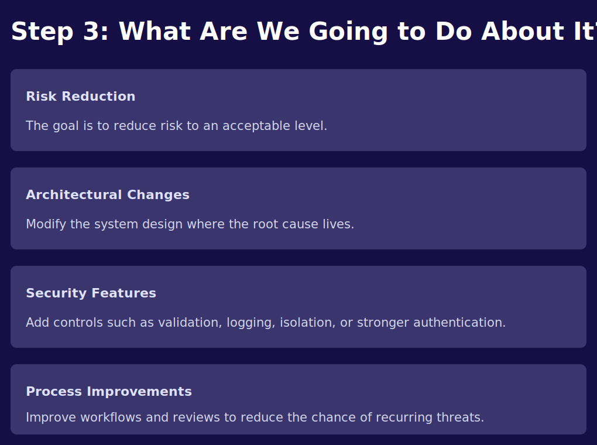

- Choose mitigations that reduce risk to an acceptable level rather than aiming for perfect elimination.
- Some threats require architectural changes, while others are better handled with security features or process improvements.
- The output of this step should be a clear set of actions, owners, and priorities.

### Documenting Threats

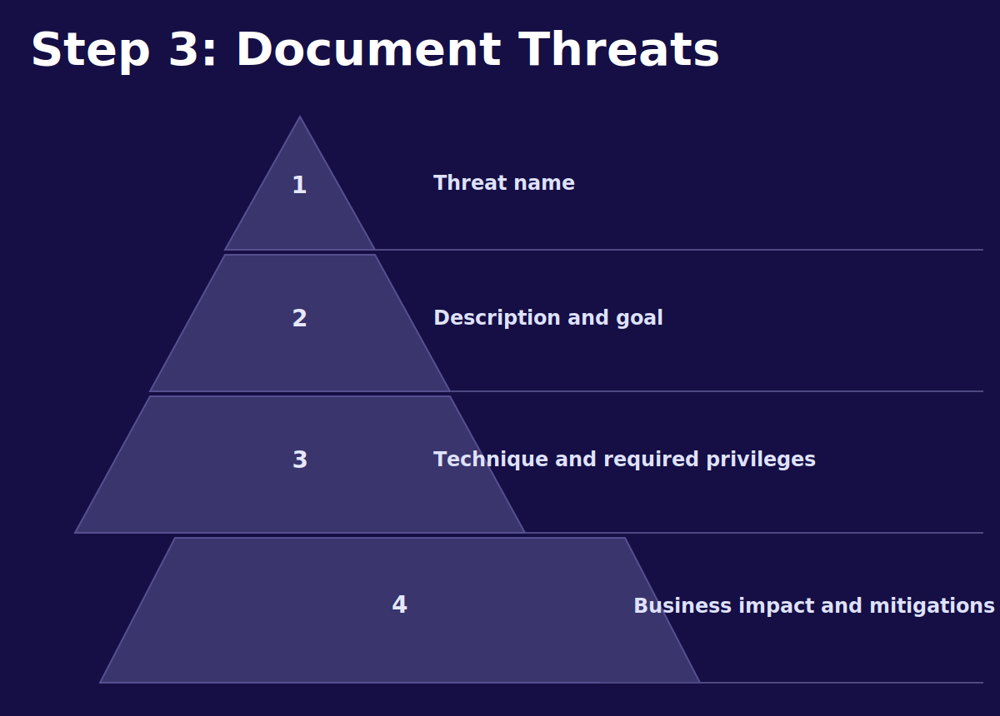

- A documented threat should be specific enough that someone else can understand the risk and decide what to do next.
- Useful documentation usually includes the threat name, a short description, the attacker's goal, the attack technique, required privileges, business impact, and recommended mitigations.
- Good documentation turns brainstorming notes into material that engineering, security, and management can actually act on.

### Example Threat Record: SQL Injection

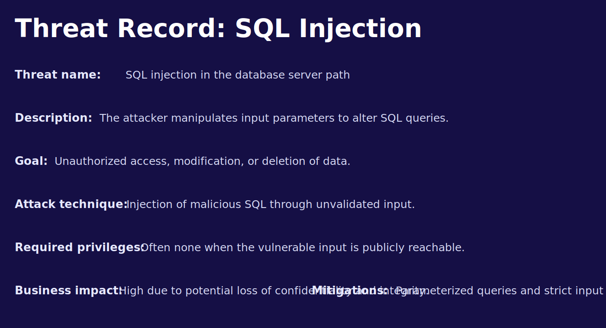

- Threat name: SQL injection in the database-facing part of the application.
- Description: an attacker manipulates input so the application sends malicious SQL to the database.
- Goal: unauthorized access, data modification, or deletion of stored information.
- Attack technique: injection through unvalidated or unsafely concatenated input values.
- Required privileges: often none if the vulnerable entry point is reachable by unauthenticated users.
- Business impact: high, because confidentiality, integrity, and possibly availability can all be affected.
- Mitigations: parameterized queries, input validation, least-privilege database accounts, and secure error handling.

### Risk Assessment

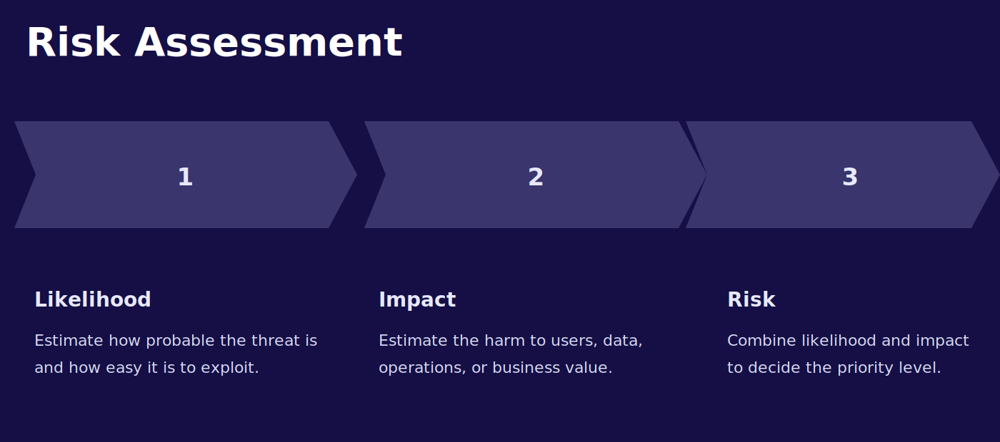

- After identifying threats, the team estimates likelihood and impact.
- Likelihood asks how probable or practical the attack is.
- Impact asks how much harm the business, users, or system would suffer if the threat is exploited.
- Combining those values helps determine the overall risk level and what should be fixed first.

### Risk Example: SQL Injection

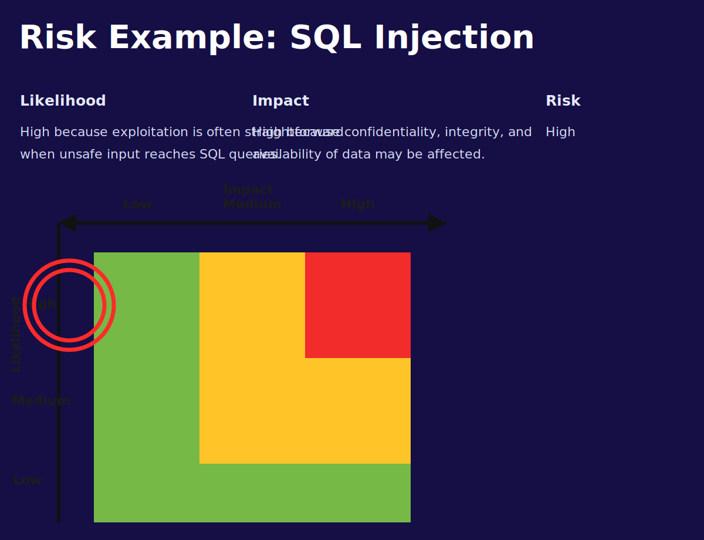

- Likelihood: high when input reaches the database directly and exploitation is straightforward.
- Impact: high because the attacker may read, change, or delete sensitive data.
- Risk: high, so remediation should be prioritized immediately.

### Risk Example: Cross-Site Scripting

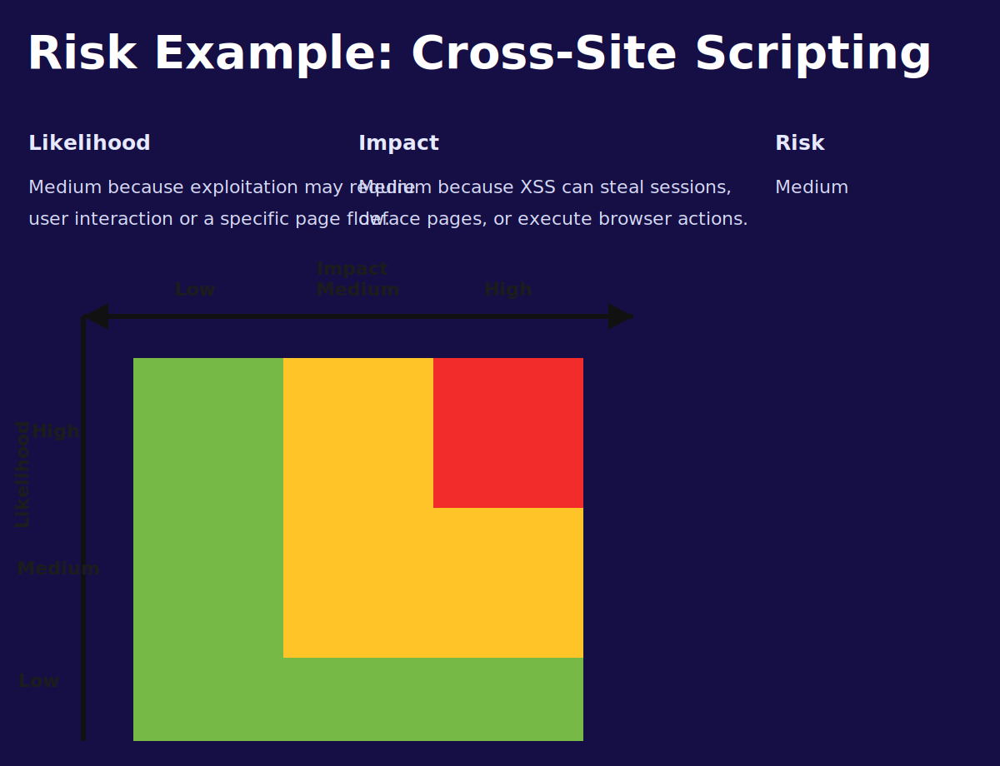

- Likelihood: medium when exploitation requires user interaction or a specific rendering path.
- Impact: medium because XSS can still lead to session theft, defacement, or malicious actions in the victim's browser.
- Risk: medium, which still requires treatment but may be scheduled after higher-risk issues.

### Threat Prioritization

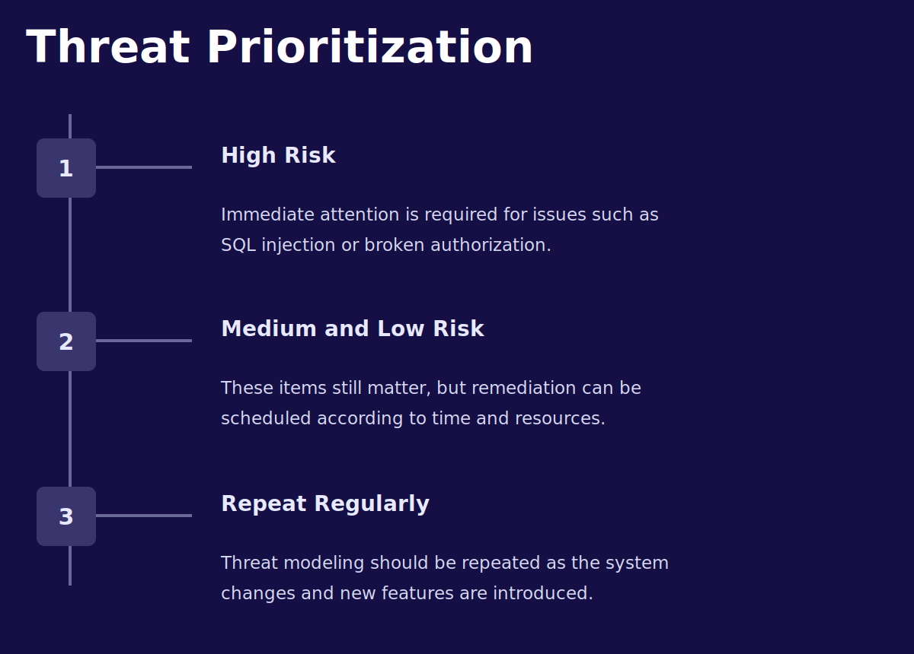

- High-risk issues need immediate attention because they combine realistic exploitation with serious business impact.
- Medium- and low-risk issues should still be tracked, but their remediation can often be scheduled based on available resources.
- Prioritization should be revisited regularly because system changes can increase or reduce risk over time.

## Step 4: Did We Do a Good Enough Job?

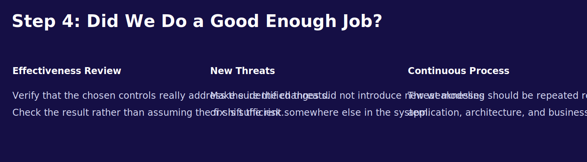

- Review whether the selected controls actually address the identified threats.
- Check whether the changes introduced new weaknesses or unexpected side effects.
- Treat threat modeling as a repeatable process that should be revisited as the system evolves.

## Summary of the Four Questions

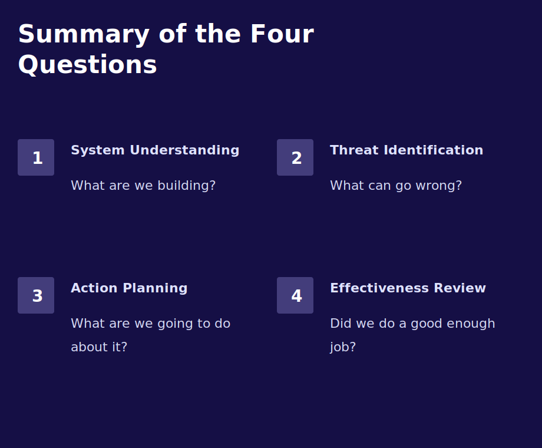

- First understand the system.
- Then identify what could go wrong.
- Next decide what actions to take.
- Finally verify whether the result is good enough.

## Practical References

- OWASP Cheat Sheets provide short, practical guidance for common security problems.
- They are useful during threat modeling when the team needs mitigation ideas, secure design reminders, or implementation guidance.

## Outputs of Threat Modeling
- Better system diagrams and trust-boundary awareness.
- A prioritized list of security requirements.
- Early detection of design weaknesses before implementation costs increase.
- A shared understanding between developers, architects, and security teams.

## Team Participation

- Invite people from different roles when the system or business process is complex.
- Broader participation improves coverage because each role sees different risks and assumptions.
- When time is limited, a focused session with the core engineering team is usually better than a large unfocused meeting.

## Attacker Goals and Motivation

- Understanding attacker goals helps explain what the adversary is trying to achieve.
- Motivation analysis helps identify why a person or group might launch an attack.
- Asset protection improves when we identify which resources are most attractive to attackers.

## Threat Modeling vs Vulnerability Assessment

- Vulnerability assessment focuses on finding known weaknesses in systems and software.
- Threat modeling focuses on how attackers might misuse the design, architecture, data flows, or trust relationships.
- A useful rule of thumb is that vulnerability assessment is more defender-centric, while threat modeling deliberately studies the attacker's perspective.

## Notes
- Threat modeling is not about predicting every attack. It is about systematically reducing blind spots.
